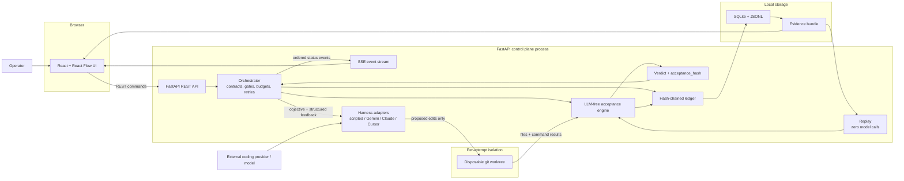

# MergeGate architecture

MergeGate separates the component that proposes code from the component that
accepts it. This is a trust boundary, not merely a UI distinction: harness
output is an input to validation and has no write path to the verdict.

GitHub renders the Mermaid source directly, so the diagram and its review
history stay in the repository.

## Component boundaries

### Browser control plane

The React UI contains five operator surfaces: top bar, node library, graph
canvas, selected-node inspector, and collapsible run console/evidence view. It
sends lifecycle commands over REST and consumes ordered run events over SSE.
A reconnect can request events after `Last-Event-ID` while the same backend
process remains alive.

Relevant source:

- [`frontend/src/layout/AppShell.tsx`](../frontend/src/layout/AppShell.tsx)
- [`frontend/src/state/sseClient.ts`](../frontend/src/state/sseClient.ts)
- [`frontend/src/evidence/EvidencePanel.tsx`](../frontend/src/evidence/EvidencePanel.tsx)

### API and orchestration

FastAPI owns workflow import/export and the contract-before-code run lifecycle.
The orchestrator freezes approved criteria, enforces budgets, creates attempts,
routes structured feedback into retries, and exposes the two human gates. It
does not accept a provider's claim that work is complete.

Relevant source:

- [`backend/src/mergegate/api/runs.py`](../backend/src/mergegate/api/runs.py)
- [`backend/src/mergegate/orchestrator/nodes.py`](../backend/src/mergegate/orchestrator/nodes.py)
- [`backend/src/mergegate/orchestrator/gates.py`](../backend/src/mergegate/orchestrator/gates.py)

### Generation boundary

Harness adapters receive the objective and, on later attempts, structured
failure feedback. They operate only inside a disposable git worktree. The
scripted adapter provides a zero-network deterministic demo; Gemini CLI and
other adapters are replaceable configuration.

The harness can return changed files, a diff, logs, and usage accounting. It
cannot set `Run.status`, construct a passing verdict, or approve a gate.

Relevant source:

- [`backend/src/mergegate/harness/base.py`](../backend/src/mergegate/harness/base.py)
- [`backend/src/mergegate/harness/gemini.py`](../backend/src/mergegate/harness/gemini.py)
- [`backend/src/mergegate/workspace/worktree.py`](../backend/src/mergegate/workspace/worktree.py)

### Acceptance boundary

The LLM-free acceptance engine runs the approved criteria in a defined order,
records command, output, exit code, and duration, checks policy before granting
a verdict, and computes the `acceptance_hash`. Task-specific proof is valid
only when the unchanged baseline genuinely fails and the proposed result
passes.

Replay takes a recorded verdict back through deterministic verdict computation
with the provider disabled. It makes zero model calls and must reproduce the
same result and `acceptance_hash`.

Relevant source:

- [`backend/src/mergegate/acceptance/engine.py`](../backend/src/mergegate/acceptance/engine.py)
- [`backend/src/mergegate/acceptance/verdict.py`](../backend/src/mergegate/acceptance/verdict.py)
- [`backend/src/mergegate/acceptance/replay.py`](../backend/src/mergegate/acceptance/replay.py)

### Receipts and storage

Run events are appended to a ledger whose entries include the previous hash.
SQLite supports ordered queries and JSONL provides a portable mirror. Terminal
runs can assemble a schema-validated evidence bundle with the contract, plan,
diff, commands, red/green proof, policy results, retries, cost, time, terminal
state, and ledger.

Relevant source:

- [`backend/src/mergegate/ledger/ledger.py`](../backend/src/mergegate/ledger/ledger.py)
- [`backend/src/mergegate/ledger/bundle.py`](../backend/src/mergegate/ledger/bundle.py)
- [`evidence-bundle.schema.json`](../specs/001-mergegate-control-plane/contracts/evidence-bundle.schema.json)

## State and failure flow

1. A run begins at `awaiting_gate` while criteria are drafted.
2. Approval freezes the contract; start first checks it for contradictions.
3. A contradiction goes directly to `CLARIFICATION_REQUIRED` with zero
   attempts.
4. Otherwise each attempt receives an isolated worktree and a harness proposal.
5. Policy runs before acceptance. A violation becomes `POLICY_BLOCKED`.
6. Failed deterministic checks produce structured feedback for the next
   attempt. Identical failures without diff progress become `NO_PROGRESS`;
   budgets yield `EXHAUSTED` or `TIMED_OUT`.
7. A passing verdict waits at the final human gate. Approval produces
   `SUCCESS`; rejection produces `HUMAN_REJECTED`.
8. Manual stop produces `CANCELLED`. No exception path produces `SUCCESS`.

## Deployment boundary

Local development runs Vite on port 5173 and FastAPI on port 8000. Docker
Compose adds an nginx-served frontend and the demo-repository service on port
9000. The backend mounts the repository so it can create git worktrees.

The shipped container does not bundle external provider CLIs. Its reliable
default is the scripted provider. Live Gemini CLI validation uses the local
backend with inherited ADC and Vertex environment variables; credentials and
generated CLI configuration remain outside source control.

## Persistence limitation

The ledger writer itself can continue an existing SQLite hash chain, but the
public API currently keeps its workflow/run registry and SSE history in
process-local memory and writes ledgers under a process temporary directory.
Consequently a browser refresh is recoverable while the backend stays alive,
but an application-level resume after backend restart is not wired. See
[Known limitations](../README.md#known-limitations).
